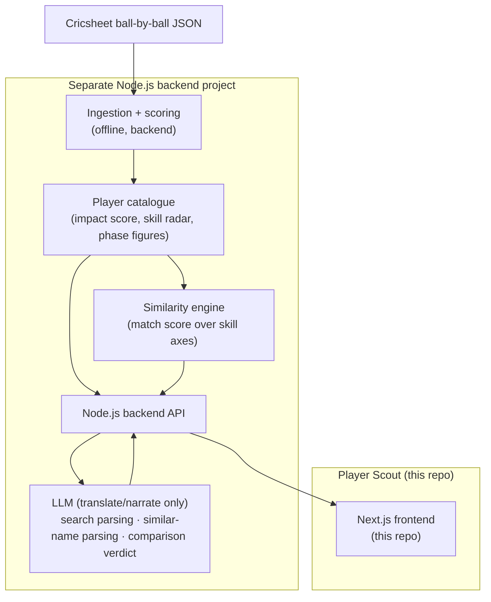

# Player Scout — Project Overview

> An AI scouting assistant for Indian domestic cricket: search players in plain English, inspect a transparent skill profile, and see who they're similar to — with the reasons shown, not hidden behind a black-box ranker.

**Live app:** https://player-scout-web-app.vercel.app/ (frontend hosted on Vercel).

---

## 1. The Problem

An IPL franchise's scouting team faces an impossible task:

- **Volume**: hundreds of domestic matches per season. No scouting team can watch them all.
- **Blunt statistics**: Traditional numbers (runs, wickets, average) hide the context that actually predicts T20 success. A bowler with an ordinary overall economy might be *elite specifically in the death overs* — exactly the skill franchises pay crores for.
- **Recency and reputation bias**: Auctions systematically overpay for famous names and recent highlights, and underpay for consistent, context-specific skills that don't make highlight reels.

## 2. The Idea

Player Scout ingests public ball-by-ball data, scores every player into a skill profile
(overall impact, skill-radar axes, phase-by-phase figures), and answers the questions a
scout actually asks:

| Scout's question | Player Scout capability |
|---|---|
| "Show me left-arm death bowlers under ₹50 lakh." | **Search** — an LLM parses the plain-English request into structured filters; deterministic code ranks. The LLM translates language, never ranks. |
| "How good is this player, and where?" | **Player profile** — a 0–100 impact score, a 0–10 skill radar, and powerplay/middle/death figures. |
| "Find me another Bumrah." | **Similarity** — every other player ranked by a match score, plus a per-axis "why they're similar" comparison. |

**The key framing**: the AI narrates and translates; the analytics pipeline computes every
number, and every recommendation shows its work.

## 3. Scope

Three capabilities, all demo-friendly:

1. **Search** — natural-language query → ranked catalogue players.
2. **Player profile** — impact score, skill radar, economy-by-phase.
3. **Similarity + explanation** — ranked similar players and a side-by-side skill-axis comparison with a written verdict.

### Explicit non-goals

- No video/computer-vision analysis.
- No live model training — all scores are precomputed by the backend.
- No coverage of all cricket — IPL + the Syed Mushtaq Ali Trophy only (the two competitions Cricsheet publishes for Indian domestic T20).

## 4. Architecture

- **This repo** is the frontend only. The backend is a separate Node.js project; its API contract lives in [03-api-endpoints-and-ai.md](./03-api-endpoints-and-ai.md).
- The **LLM is not the intelligence** — the pipeline computes every number; the LLM only parses free text and narrates computed comparisons.

## 5. Tech Stack

| Layer | Choice | Notes |
|---|---|---|
| Frontend | Next.js (App Router), TypeScript, Tailwind CSS | This repo |
| Data fetching | TanStack Query (client) + Server Components | See `src/lib/api.ts` |
| Charts | Recharts | Skill radar, phase-wise bars |
| Backend | Node.js | Separate project; see doc 03 |
| Similarity | Match score over skill-radar axes, in plain Node | Fits in memory; no vector DB |
| LLM | Query/name parsing + comparison verdict | Translator/narrator only, never ranks; deterministic fallback |
| Data | Cricsheet (open ODC-By license) | See doc 04 |

## 6. Document Map

| File | Contents |
|---|---|
| [01-overview.md](./01-overview.md) | This file — vision, scope, architecture |
| [02-sections-detailed.md](./02-sections-detailed.md) | Deep dive: data, features, similarity, skill-radar & phase figures, frontend pages |
| [03-api-endpoints-and-ai.md](./03-api-endpoints-and-ai.md) | The 6-endpoint REST contract + how the LLM is used |
| [04-data-sources.md](./04-data-sources.md) | Where the data comes from, the ingestion pipeline, licensing |
| [05-design-system.md](./05-design-system.md) | Design tokens and theming |
