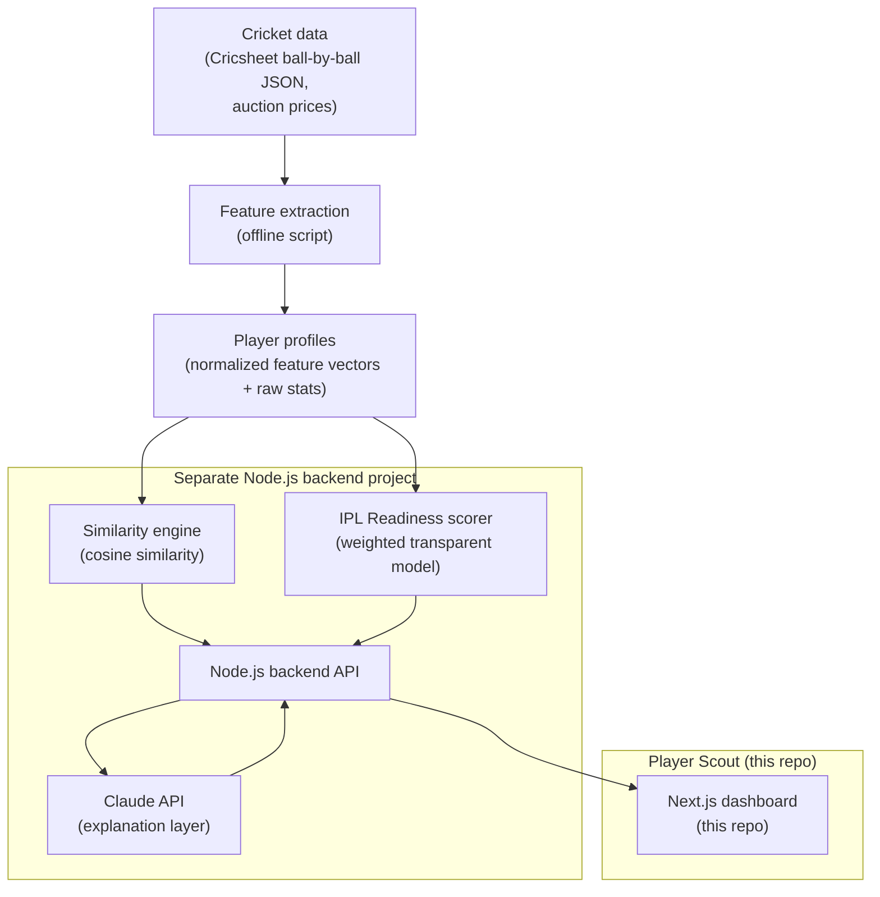

# Player Scout — Project Overview

> **Moneyball for the IPL.** An AI scouting assistant that discovers undervalued domestic cricketers and — crucially — *explains why* they are undervalued, instead of acting as a black-box ranker.

---

## 1. The Problem

An IPL franchise's scouting team faces an impossible task:

- **Volume**: 500+ domestic matches per season across Syed Mushtaq Ali Trophy (SMAT), Vijay Hazare Trophy, and Ranji Trophy. No scouting team can watch them all.
- **Blunt statistics**: Traditional numbers (runs, wickets, average) hide the context that actually predicts T20 success. A bowler with an ordinary overall economy might be *elite specifically in the death overs* — exactly the skill franchises pay crores for.
- **Recency and reputation bias**: Auctions systematically overpay for famous names and recent highlights, and underpay for consistent, context-specific skills that don't make highlight reels.

The result: genuine match-winners go for ₹20–40 lakh while comparable skills in a famous player cost ₹4+ crore.

## 2. The Idea

Player Scout ingests public ball-by-ball data, turns every player into a rich **feature vector** (death-overs economy, strike rate vs spin, dot-ball % under pressure, …), and then answers three questions a scout actually asks:

| Scout's question | Player Scout capability |
|---|---|
| "Find me a left-arm death bowler under ₹50 lakh." | **Smart search** — Gemini parses the plain-English request into a structured query; the engine ranks. The LLM translates language, never ranks |
| "Find me another Bumrah." | **Similarity search** — cosine similarity over player vectors, with a per-feature breakdown of *why* they're similar |
| "Is this domestic player ready for the IPL?" | **IPL Readiness Score** — a transparent, weighted 0–100 score with visible per-feature contributions |
| "Why should I trust this recommendation?" | **LLM explanation** — Claude turns the computed numbers into a grounded scouting report; it never invents stats |

**The key framing**: the AI isn't predicting who is *better*. It's explaining who is *undervalued* — and showing its work.

## 3. Hackathon Scope (locked)

Three core capabilities, all achievable and all demo-friendly:

1. **Find similar players** — "Find the next Bumrah" search returning ranked candidates with similarity % and top contributing features.
2. **Predict IPL readiness** — transparent scoring model over engineered features.
3. **Explain the recommendation** — Claude-generated scouting summary + interactive side-by-side stat comparison.

### Stretch features (build only if time allows)

- **Undervalued Talent page** — Top-10 hidden gems: expected auction price vs expected value, with reason tags ("elite death bowling", "strong fielding"). This is the "Moneyball moment" of the demo.
- **Team Fit** — "Best player *for RCB*": match players against a franchise's needs profile (roles needed, budget, overseas slots).

### Explicit non-goals

- No video/computer-vision analysis.
- No live model training — all scores are precomputed.
- No coverage of all cricket — IPL + Indian domestic T20 only.

## 4. Architecture

- **This repo** is the frontend only. The backend is a separate Node.js project; its full API contract lives in [03-api-endpoints-and-ai.md](./03-api-endpoints-and-ai.md).
- The **LLM is not the intelligence** — the analytics pipeline computes every number; Claude only narrates them.

## 5. Tech Stack

| Layer | Choice | Notes |
|---|---|---|
| Frontend | Next.js (App Router), TypeScript, Tailwind CSS | This repo |
| Charts | Recharts | Radar charts, phase-wise bars, scatter plots |
| Backend | Node.js (Express or Fastify) | Separate project; see doc 03 |
| Database | PostgreSQL | Player profiles, precomputed scores, cached explanations |
| Similarity | Cosine similarity in plain Node | ~500 players fits in memory; no vector DB needed |
| Readiness model | Weighted feature scoring | Transparent > opaque for a hackathon demo |
| LLM (explain) | Claude API (Anthropic) | Grounded explanations only; responses cached per player |
| LLM (search) | Gemini API (Google) | Parses free-text queries into structured filters; translator only, never ranks |
| Data | Cricsheet (open ODC-By license) + Kaggle auction datasets | See doc 04 |

## 6. The Demo (3-minute judge walkthrough)

1. **Search**: type "Find the next Bumrah" → ranked results appear: *Arjun Kumar 91%, Rahul Nair 88%, Imran Shaikh 84%*.
2. **Click a player** → player detail page:
   - Radar chart of skills (batting / bowling / fielding / pressure)
   - Side-by-side comparison table vs Bumrah (death economy 6.8 vs 6.9, dot-ball % 49 vs 47, …)
   - **AI scouting report card**: "Bowls 42% of death-overs deliveries as dots, economy 6.8 in overs 16–20, comparable to early-career IPL death specialists…"
3. **Undervalued page**: Top-10 hidden gems — "Expected auction ₹40 lakh, expected value ₹4.2 crore. Reason: elite death bowling, above-average fielding."
4. **Punchline**: every claim on screen traces back to a computed number the judges can see. Explainable scouting, not a black box.

## 7. Why This Impresses Judges

- **Explainability is the product.** Most AI demos are black boxes; Player Scout shows per-feature reasoning for every recommendation.
- **The LLM is used correctly** — as a narration layer over real analytics, not as the analytics. Judges who are skeptical of "GPT-wrapper" projects will notice this.
- **A real economic story**: the undervalued-talent page mirrors Moneyball — finding value where the market isn't looking — and gives the demo an emotional hook.
- **Honest data engineering**: all features derive from public ball-by-ball data with documented formulas (see doc 02), including honest notes on what *can't* be derived (e.g. true yorker %).

## 8. Document Map

| File | Contents |
|---|---|
| [01-overview.md](./01-overview.md) | This file — vision, scope, architecture, demo script |
| [02-sections-detailed.md](./02-sections-detailed.md) | Deep dive into every pipeline stage: data, features (with formulas), similarity, readiness score, undervalued index, team fit, LLM layer, frontend pages |
| [03-api-endpoints-and-ai.md](./03-api-endpoints-and-ai.md) | Complete REST contract for the Node.js backend + AI integration spec (cosine similarity, scoring, Claude prompts) |
| [04-data-sources.md](./04-data-sources.md) | Where every byte of data comes from, download links, processing pipeline, licensing |
